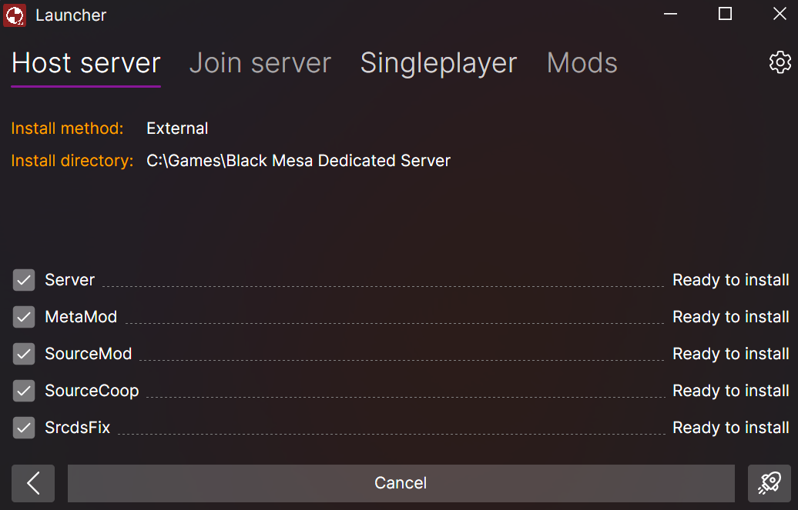
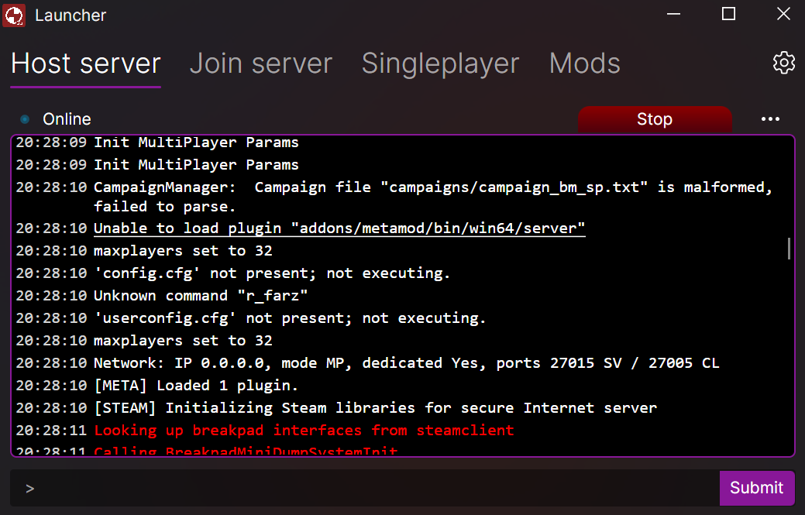
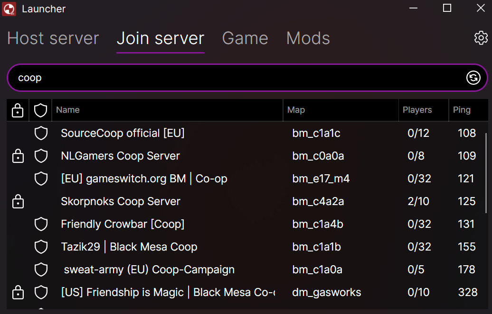

# A self-contained GUI launcher for [SourceCoop](https://github.com/ampreeT/SourceCoop).

> [!NOTE]
> Currently supports Black Mesa only.

## Features
### Install game server - Including necessary dependencies

### Host & configure game server

### Join game servers

### Launch & configure game client

## Planned features
- Built-in tunneling (playit.gg or alternatives)
- Install new campaign mods on server and client
- Select active campaign mod on server and client

## Known issues
#### Windows application error when starting the server
- Download and install vc_redist (x86) for 2013 and 2015-2022 from [Microsoft](https://learn.microsoft.com/en-us/cpp/windows/latest-supported-vc-redist?view=msvc-170#latest-supported-redistributable-version).

## Made possible by
- [Avalonia UI](https://avaloniaui.net/)
- [DepotDownloader](https://github.com/SteamRE/DepotDownloader) / [DepotDownloaderSubProcess](https://github.com/Alienmario/DepotDownloaderSubProcess)
- [Tmds.ExecFunction](https://github.com/tmds/Tmds.ExecFunction)
- [srcds-pipe-passthrough-fix](https://github.com/tsuza/srcds-pipe-passthrough-fix)
- [SourceLogger](https://github.com/LukWebsForge/SourceLogger)
- [Gameloop.Vdf](https://github.com/shravan2x/Gameloop.Vdf)
- [SteamQuery.NET](https://github.com/cemahseri/SteamQuery.NET)

Special thanks to Removiekeen for initial concept and logo.
