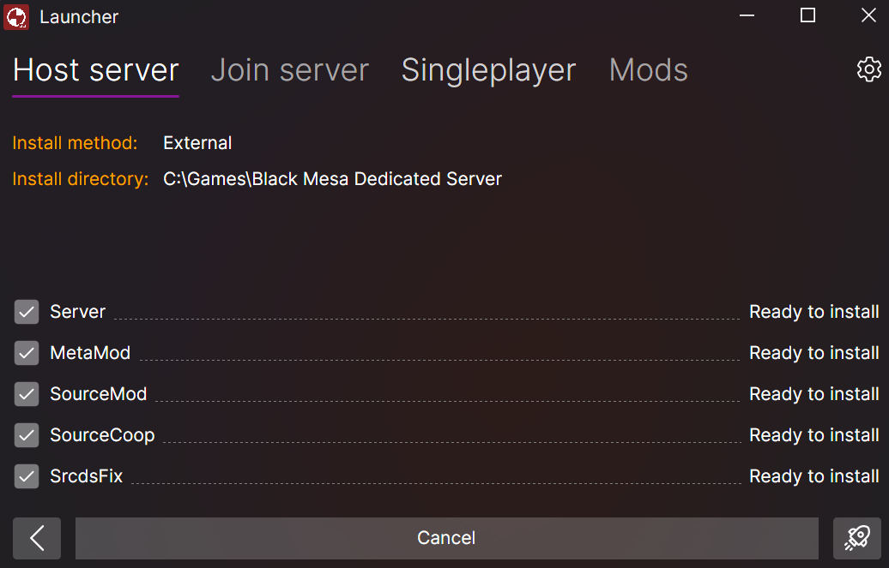
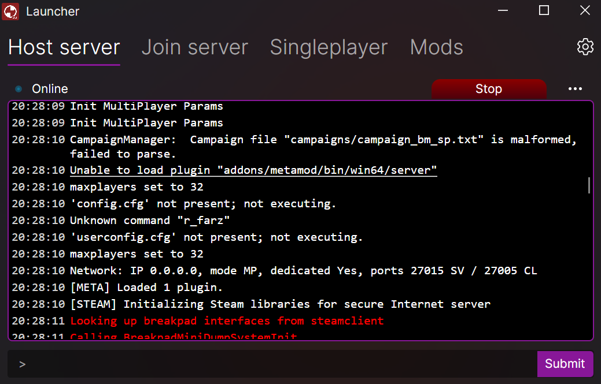
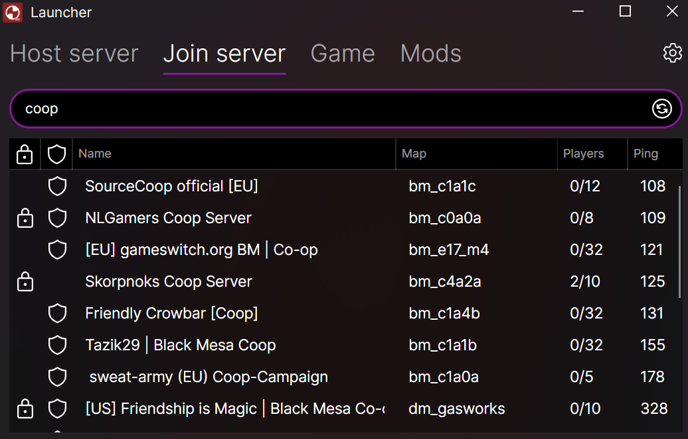
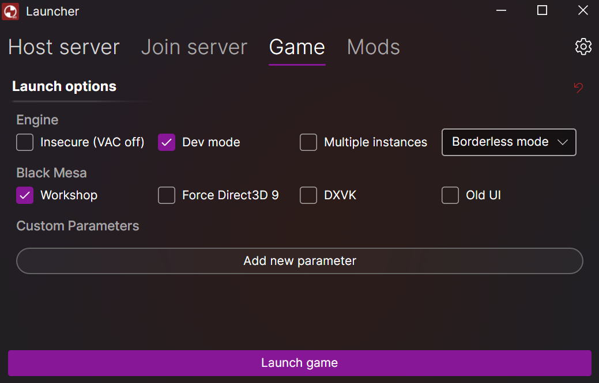

### Modern, minimalistic, self-contained, cross-platform graphical launcher for Source engine games and mods

## Features
### Multi-game with customizable profiles
`Black Mesa`, `Half-Life 2 Deathmatch`, `Team Fortress 2`, `Counter-Strike: Source`, `Day of Defeat: Source`, `Garry's Mod`, `Left 4 Dead`, `Left 4 Dead 2`, `Insurgency`, `Synergy`, `No More Room in Hell`, `Source SDK Base 2013`

### Install local game servers
- No need to mess around with SteamCMD commands
- Supports Steam library and standalone downloads via integrated DepotDownloader
- One click install for addons like [Metamod:Source](https://www.sourcemm.net/), [SourceMod](https://www.sourcemod.net/), [SourceCoop](https://github.com/ampreeT/SourceCoop), [ModelChooser](https://github.com/Alienmario/ModelChooser)
- Analyzes installed versions, marks available updates
 

### Run & configure game servers
- Setup launch paremeters
- Enter console commands
- No extra windows, runs fully within the launcher

### Join game servers
- Browse the master server list (Steam API key required)
- Query servers by address or Steam connect link

### Launch & configure game client
- Quick toggles for common launch parameters

## Planned features
- Built-in tunneling (playit.gg or alternatives)
- Install new campaign mods on server and client
- Select active campaign mod on server and client

## Known issues
#### Windows application error appears when starting a server
- Download and install vc_redist (x86) for 2013 and 2015-2022 from [Microsoft](https://learn.microsoft.com/en-us/cpp/windows/latest-supported-vc-redist?view=msvc-170#latest-supported-redistributable-version).

## Fun facts
- The launcher stores all of its data at `%LocalAppData%\SCLauncher`, it can be run from any location
- It was written by a human programmer with passion for Source Engine
- Its original purpose was to simplify the setup of Black Mesa's SourceCoop mod

## Made possible by
- [Avalonia](https://avaloniaui.net/) - _**Cross platform UI framework**_
- [DepotDownloader](https://github.com/SteamRE/DepotDownloader) / [DepotDownloaderSubProcess](https://github.com/Alienmario/DepotDownloaderSubProcess) - _**Used internally for downloading dedicated servers**_
- [srcds-pipe-passthrough-fix](https://github.com/tsuza/srcds-pipe-passthrough-fix) - _**Provides fixed srcds binary for third-party apps on Windows**_
- [SourceLogger](https://github.com/LukWebsForge/SourceLogger) - _**Provides fixed srcds binary for third-party apps on Linux**_
- [Gameloop.Vdf](https://github.com/shravan2x/Gameloop.Vdf) - _**Library for working with VDF files**_
- [SteamQuery.NET](https://github.com/cemahseri/SteamQuery.NET) - _**Library for querying dedicated servers**_
- Removiekeen - _**Initial concept art**_
