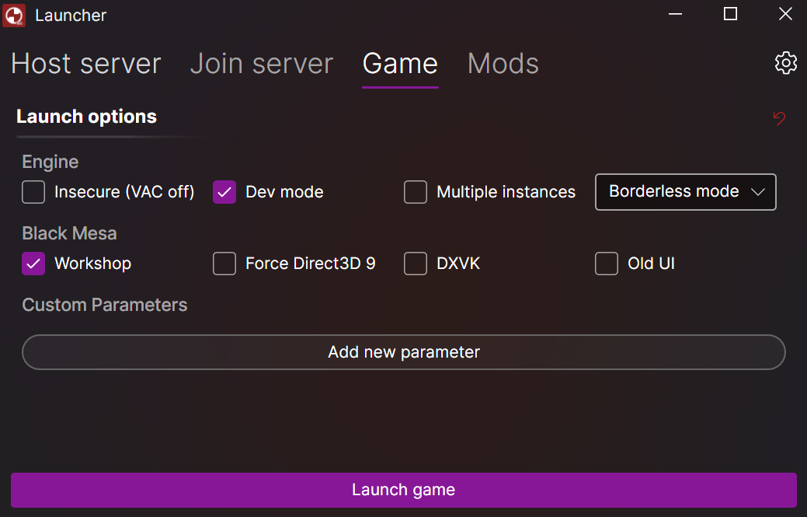

### Modern, minimalistic, self-contained, cross-platform graphical launcher for Source engine games and mods

## Features
### Multi-game with customizable profiles
- Supports `Black Mesa`, `Half-Life 2 Deathmatch`, `Team Fortress 2`, `Counter-Strike: Source`, `Day of Defeat: Source`, `Garry's Mod`, `Left 4 Dead`, `Left 4 Dead 2`, `Insurgency`, `Synergy`, `No More Room in Hell`, `Source SDK Base 2013`

### Install game servers
- Built-in support for addons like [Metamod:Source](https://www.sourcemm.net/), [SourceMod](https://www.sourcemod.net/), [SourceCoop](https://github.com/ampreeT/SourceCoop), [ModelChooser](https://github.com/Alienmario/ModelChooser)
 

### Run & configure game servers

### Join game servers

### Launch & configure game client

## Planned features
- Built-in tunneling (playit.gg or alternatives)
- Install new campaign mods on server and client
- Select active campaign mod on server and client

## Known issues
#### Windows application error appears when starting a server
- Download and install vc_redist (x86) for 2013 and 2015-2022 from [Microsoft](https://learn.microsoft.com/en-us/cpp/windows/latest-supported-vc-redist?view=msvc-170#latest-supported-redistributable-version).

## Details
The launcher stores its persistent data at `%LocalAppData%\SCLauncher`.

## Made possible by
- [Avalonia UI](https://avaloniaui.net/)
- [DepotDownloader](https://github.com/SteamRE/DepotDownloader) / [DepotDownloaderSubProcess](https://github.com/Alienmario/DepotDownloaderSubProcess)
- [Tmds.ExecFunction](https://github.com/tmds/Tmds.ExecFunction)
- [srcds-pipe-passthrough-fix](https://github.com/tsuza/srcds-pipe-passthrough-fix)
- [SourceLogger](https://github.com/LukWebsForge/SourceLogger)
- [Gameloop.Vdf](https://github.com/shravan2x/Gameloop.Vdf)
- [SteamQuery.NET](https://github.com/cemahseri/SteamQuery.NET)

Special thanks to Removiekeen for initial concept and logo.
